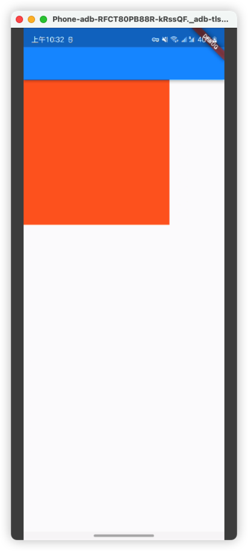

- https://juejin.cn/post/7134510980905566238
-
-
- something wrong widget
- ```dart
  Stack(
          children: <Widget>[
            GestureDetector(
              child: Positioned(
                child: Container(
                  height: 250,
                  width: 250,
                  color: Colors.red,
                ),
              ),
            )
          ],
        ),
  ```
-
- ### Debug mode:
- #### screen
- {:height 340, :width 146}
- #### console
- ```
  ======== Exception caught by widgets library =======================================================
  The following assertion was thrown while applying parent data.:
  Incorrect use of ParentDataWidget.
  
  The ParentDataWidget Positioned wants to apply ParentData of type StackParentData to a RenderObject, which has been set up to accept ParentData of incompatible type ParentData.
  
  Usually, this means that the Positioned widget has the wrong ancestor RenderObjectWidget. Typically, Positioned widgets are placed directly inside Stack widgets.
  The offending Positioned is currently placed inside a Listener widget.
  
  The ownership chain for the RenderObject that received the incompatible parent data was:
    ConstrainedBox ← Container ← Positioned ← Listener ← _GestureSemantics ← RawGestureDetector ← GestureDetector ← Stack ← KeyedSubtree-[GlobalKey#550a5] ← _BodyBuilder ← ⋯
  When the exception was thrown, this was the stack: 
  #0      RenderObjectElement._updateParentData.<anonymous closure> (package:flutter/src/widgets/framework.dart:6042:11)
  #1      RenderObjectElement._updateParentData (package:flutter/src/widgets/framework.dart:6059:6)
  
  ```