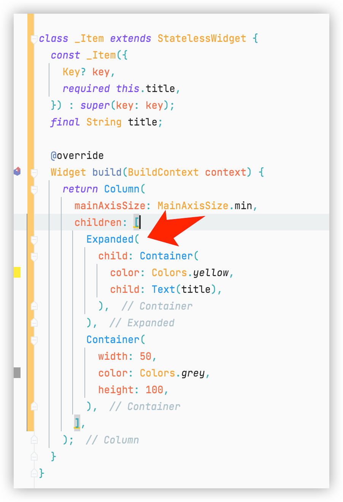
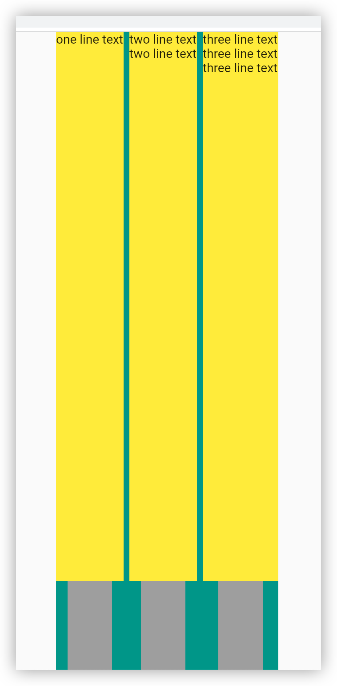
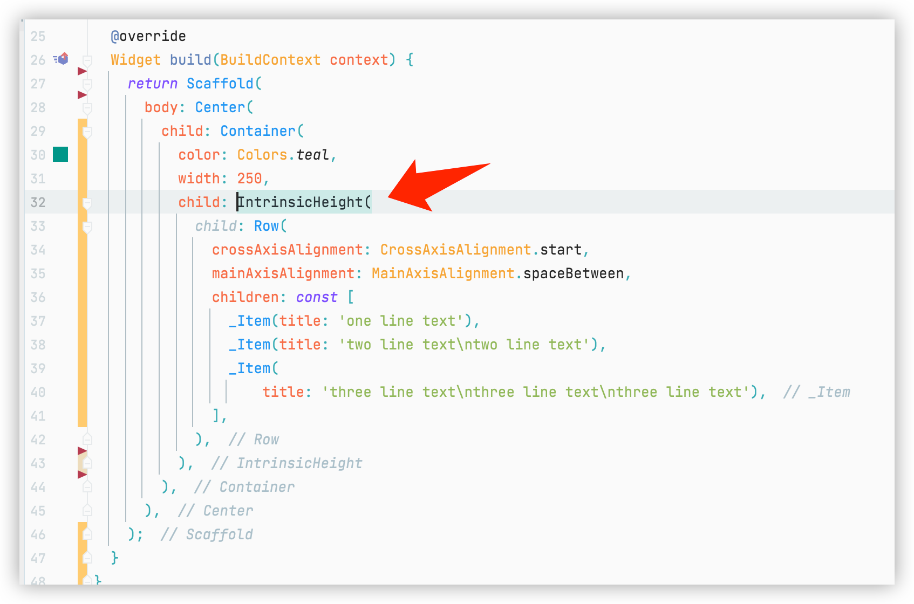
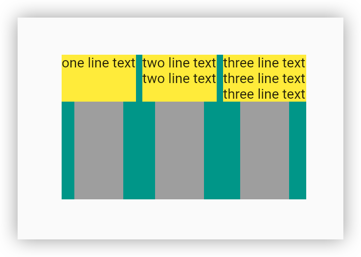

- # Requirement
- 1. The height of the white container is based on the size of the text widget
  2. White containers in the same row need to be the same height
- [[draws/2022-05-28-10-05-29.excalidraw]]
- ## Problem:
- White containers in the same row do not know the size of other white containers
- |||
  |--|--|
  |  |  |
- |||
  |--|--|
  |  |  |
- |||
  |--|--|
  |  |  |
- <p>There is an error with your mermaid syntax. Please rectify and render again.</p>
  {{renderer :mermaid_ekqyyhu}}
	- ```mermaid 
	  flowchart TB
	      Container-->|`BoxConstraints(w=250.0, 0.0<=h<=Infinity)`|B
	  ```