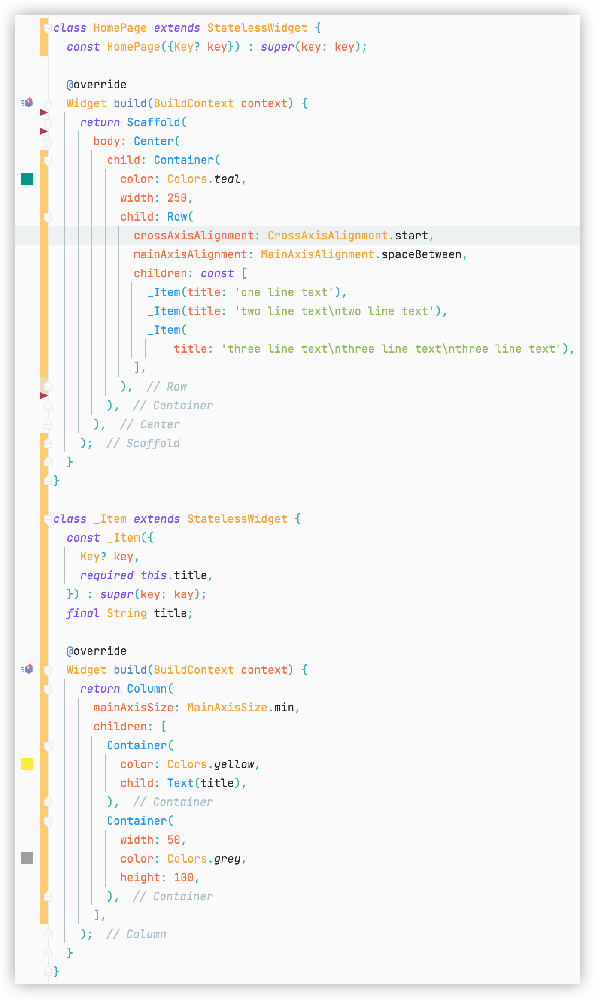
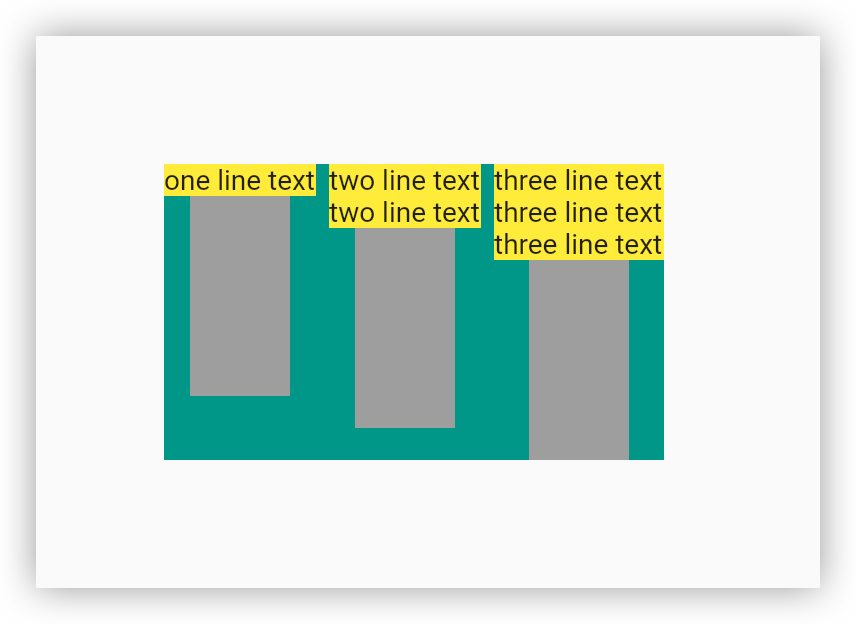

- # Requirement
- 1. The height of the white container is based on the size of the text widget
  2. White containers in the same row need to be the same height
- [[draws/2022-05-28-10-05-29.excalidraw]]
- ## Problem:
- White containers in the same row do not know the size of other white containers
- |||
  |--|--|
  |  |  |
-
- 
  {{renderer :mermaid_qzitkrejb}}
	- ```mermaid 
	      gitGraph
	         commit
	         commit
	         branch develop
	         checkout develop
	         commit
	         commit
	         checkout main
	         merge develop
	         commit
	         commit
	  ```
-