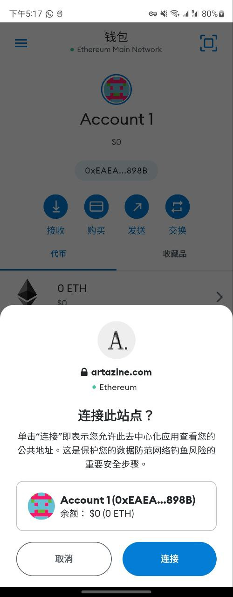
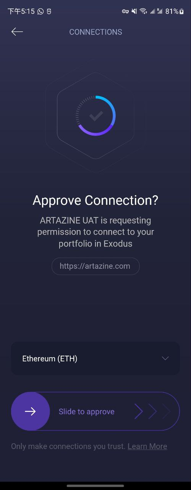
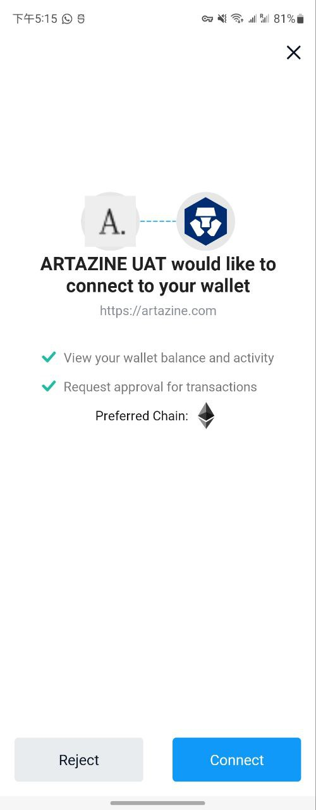
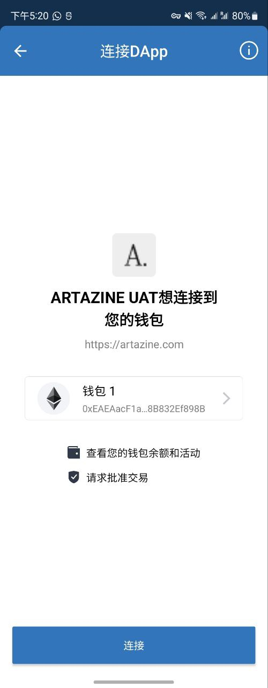

- Tutorial:
- https://dev.to/bhaskardutta/building-with-flutter-and-metamask-8h5
-
-
- `Wallet Connect` deeplink and universal link doc
- https://docs.walletconnect.com/mobile-linking#wallet-support
-
- MetaMask staff suggest use `Wallet Connect`
- https://github.com/MetaMask/metamask-mobile/issues/4500
-
-
- **Code:**
- https://github.com/WingCH/Learning/tree/main/Flutter/metamask_integration
-
- ---
-
- ## PeerMeta Behavior
-
- ||MetaMask|Exodus|Defi Wallet (Crypto.com)|Trust Wallet|
  |--|--|--|--|--|
  |android|  |  |  |  |
  |iOS|||||
- Android
- ```dart
  PeerMeta(
    name: packageInfo.appName,
    url: 'https://artazine.com',
    icons: ['https://assets.artazine.com/favicon.png'],
  ),
  ```
-
-