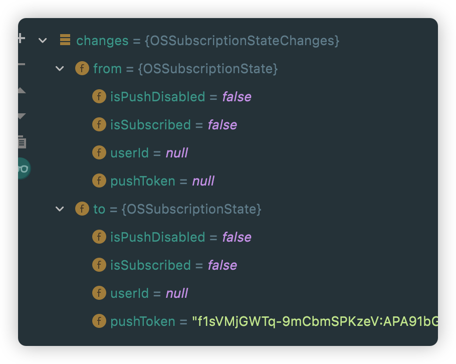
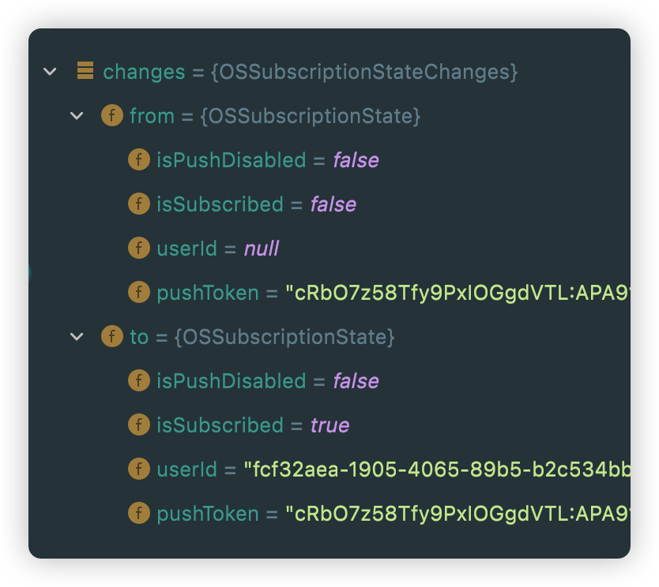
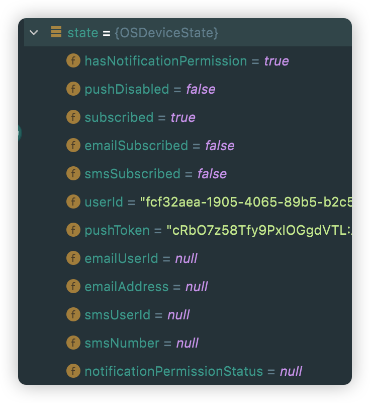
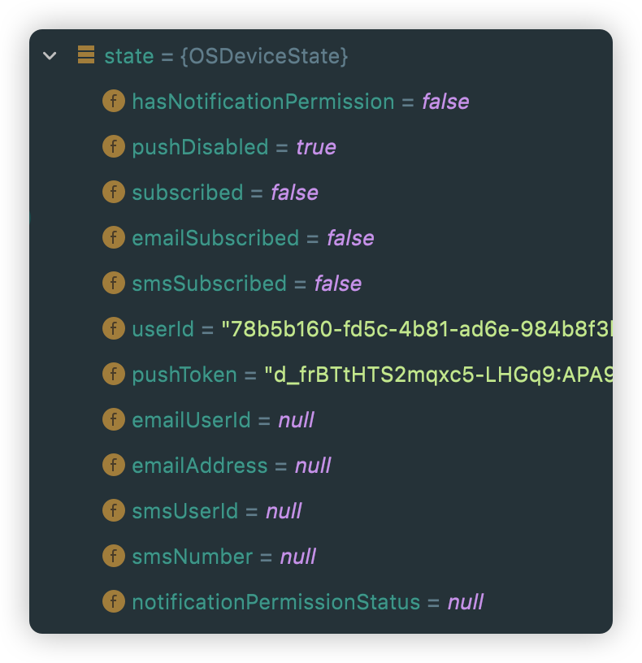
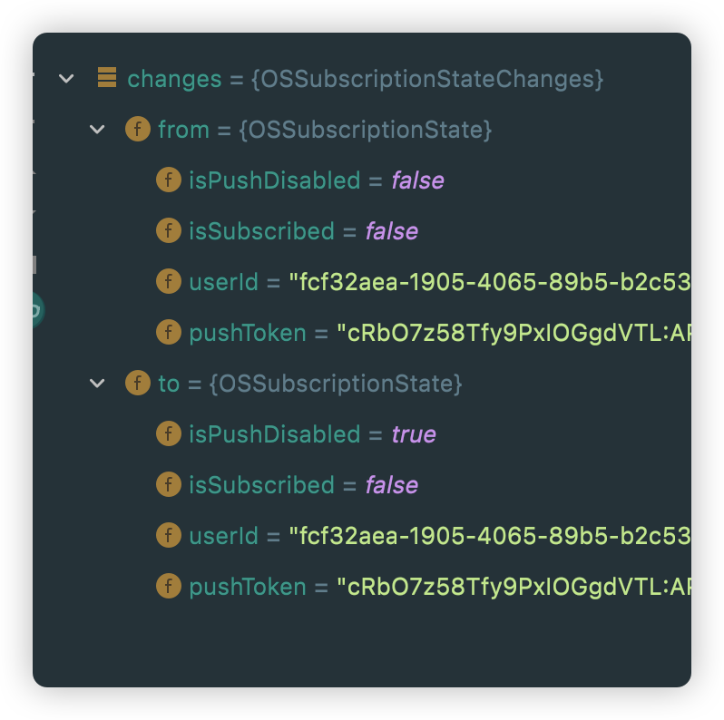
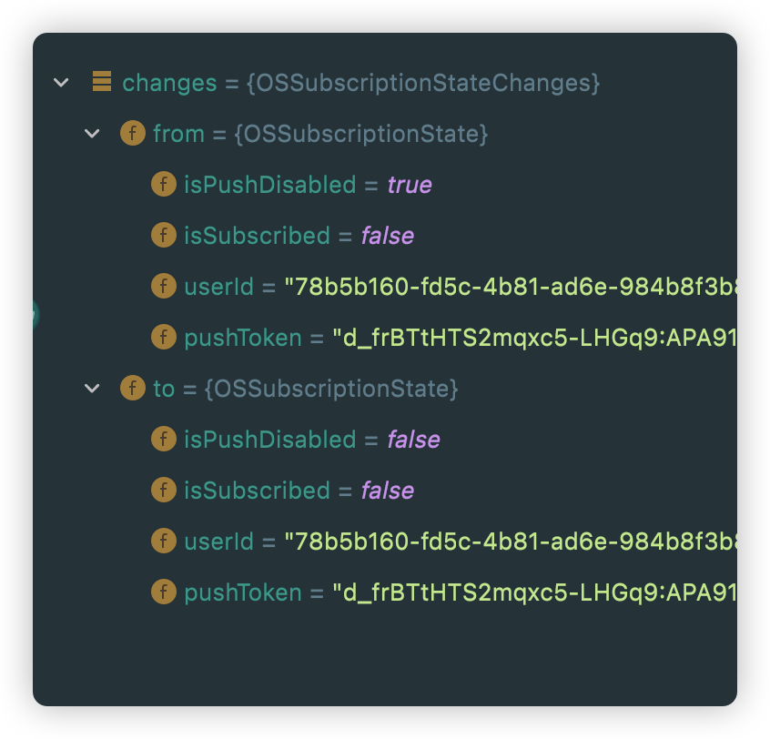
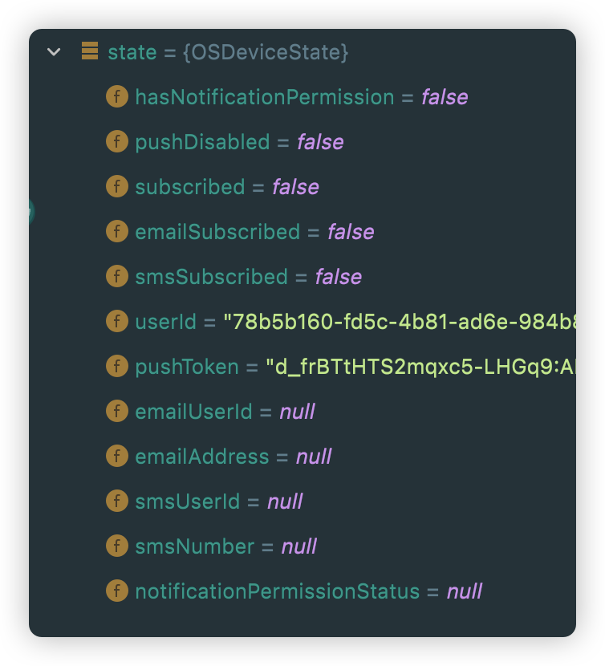

-
- |||System notification|hasNotificationPermission|pushDisabled|subscribed|notificationPermissionStatus|
  |--|--|--|--|--|--|--|
  |Android|11 RKQ1.200826.002|off|false|true|false|null|
  |Android|11 RKQ1.200826.002|on|true|false|true|null|
  |iOS||off|||||
  |iOS||on|||||
-
- ## Record
- ### Android
- 1. delete existing app
  2. install
  3. 
  ```dart
  OneSignal.shared.setLogLevel(OSLogLevel.verbose, OSLogLevel.none);
  OneSignal.shared.setAppId(EnvConfig.oneSignalAppID);
  ```
  4. `OneSignal.shared.setSubscriptionObserver` triggered
  {:width 300, :height 265}
- 5. `OneSignal.shared.setSubscriptionObserver` triggered again
  {:width 300, :height 265}
- 6. 
  ```
  OneSignal.*shared*.promptUserForPushNotificationPermission().then((accepted) {
  // accepted = false
  });
  ```
- 7. go to setting page
  8. ` OneSignal.shared.getDeviceState()`
  {:width 300, :height 265}
- 9. close app and go to setting **turn off** notification permission
  10. reopen app
  11. 
  ```dart
  OneSignal.shared.setLogLevel(OSLogLevel.verbose, OSLogLevel.none);
  OneSignal.shared.setAppId(EnvConfig.oneSignalAppID);
  ```
- 12. 
  ```dart
  OneSignal.shared.promptUserForPushNotificationPermission().then((accepted) {
  	// accepted = false
  });
  ```
- 12. go to setting page
  13. 
  ```dart
  OneSignal.shared.getDeviceState()
  ```
  {:width 300, :height 265}
  14. `OneSignal.shared.setSubscriptionObserver` triggered
  {:width 300, :height 265}
- 15. now push notification is **off** in ui
  16. click `on` in ui
  ```
  OneSignal.*shared*.disablePush(*true*);
  ```
- ```
  OneSignal.*shared*.setSubscriptionObserver
  ```
- {:width 300, :height 265}
- 17. back and open setting again
  ````
  OneSignal.*shared*.getDeviceState()
  ````
  {:width 300, :height 265}
-