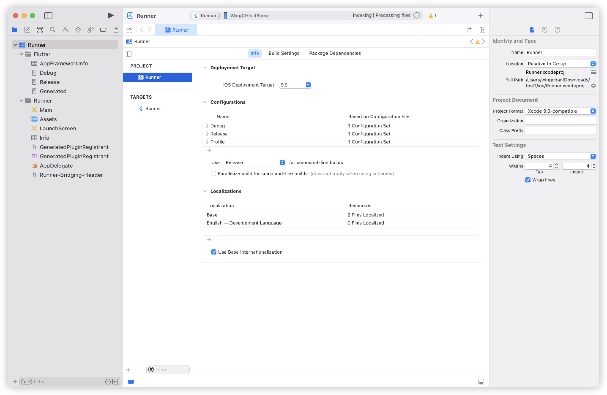
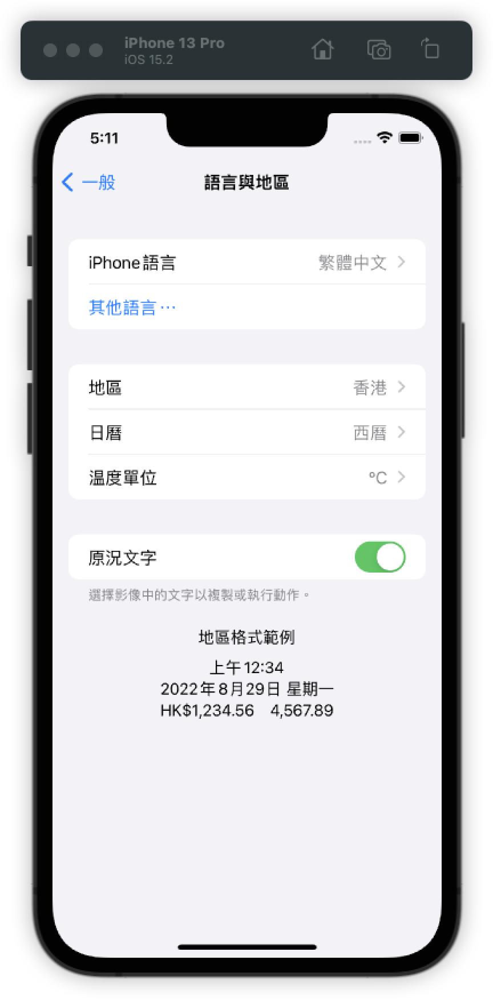

- iOS settings no display app setting item before adding `Localizations` in xcode #iOS #xcode
  collapsed:: true
	- iOS version: 15.5
	- default `Localizations` setting
	- 
- When set `Localizations` once, iOS settings will display app setting item forever, even after resetting the `Localizations` #iOS #xcode
  collapsed:: true
	- iOS version: 15.5
-
- AppleLanguages Behavior  #iOS #xcode
	- ||Language(order of priority)|Region|App support language|User selected language|AppleLanguages("UserDefaults")|Remark|
	  |--|--|--|--|--|--|--|
	  ||English|United States|English, Chinese Traditional|no|[en]||
	  ||English, **Chinese Traditional (US)**|United States|English, Chinese Traditional|no|[en, **zh-Hant-US**]|when region is US, choose `Chinese Traditional` the locale code is `zh-Hant-US`|
	  ||English, Chinese Traditional (US)|**Singapore**|English, Chinese Traditional|no|[en-**SG**, zh-Hant-US]|when change region to Singapore, locale will changed to en-SG|
	  ||English, Chinese Traditional (US), **Chinese Traditional (Hong Kong)**|Singapore|English, Chinese Traditional|no|[en-SG, zh-Hant-US, **zh-Hant-HK**]||
	  ||**Chinese Traditional (Hong Kong)**, English, Chinese Traditional (US)|Singapore|English, Chinese Traditional|no|[**zh-Hant-HK**, en-SG, zh-Hant-US]||
	  ||Chinese Traditional (Hong Kong), English, Chinese Traditional (US)|Singapore|English, Chinese Traditional|**English**|[**en-SG**, zh-Hant-HK, zh-Hant-US]||
	  ||Chinese Traditional (Hong Kong), English, Chinese Traditional (US), **Français**|Singapore|English, Chinese Traditional|English|[en-SG, zh-Hant-HK, zh-Hant-US]|Unsupported languages are not saved in `AppleLanguages` |
	  ||Chinese Traditional (Hong Kong), English, Chinese Traditional (US), Français|Singapore|English, Chinese Traditional|**Français**|[**fr-SG**, zh-Hant-HK, en-SG, zh-Hant-US]|When user select unsupported languages in iOS system page, `AppleLanguages` will have unsupported languages|
	  ||Chinese Traditional (Hong Kong), English, Chinese Traditional (US), Français|Singapore|English, Chinese Traditional|**Chinese Traditional**|[**zh-Hant-US**, zh-Hant-HK, en-SG, fr-SG]||
	  ||**Français**|United States|English, Chinese Traditional|no|[**fr-US**, en]||
-
- Case 1
	- Example project not set any Localization in Xcode
		- 
	- Simulator 語言與地區
	  collapsed:: true
		- 語言: 繁體中文
		- 地區: 香港
		- {:height 563, :width 311}
	- Use `AppleLanguages` get user default
		- ```swift
		  UserDefaults.standard.array(forKey: "AppleLanguages")
		  // [ "zh-Hant-HK" ]
		  ```
-