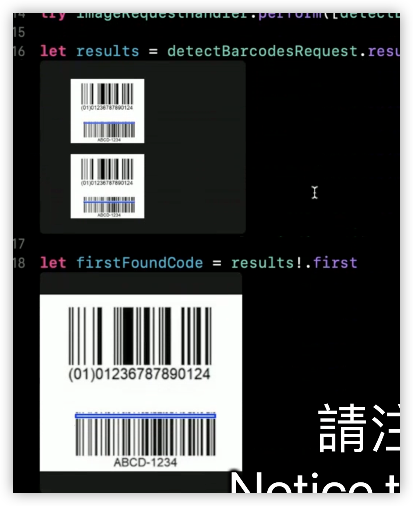
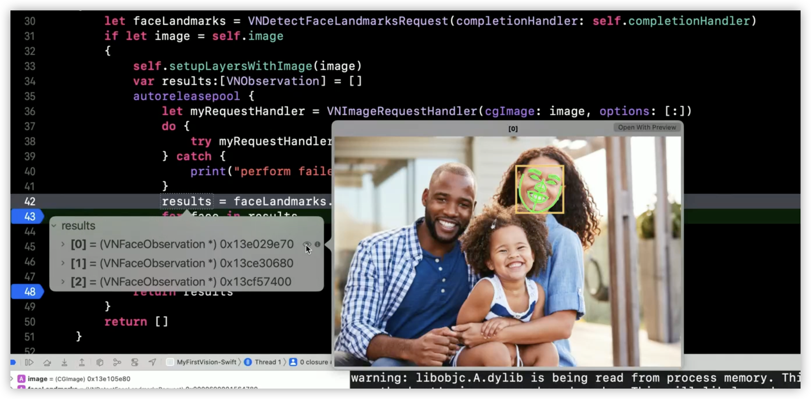
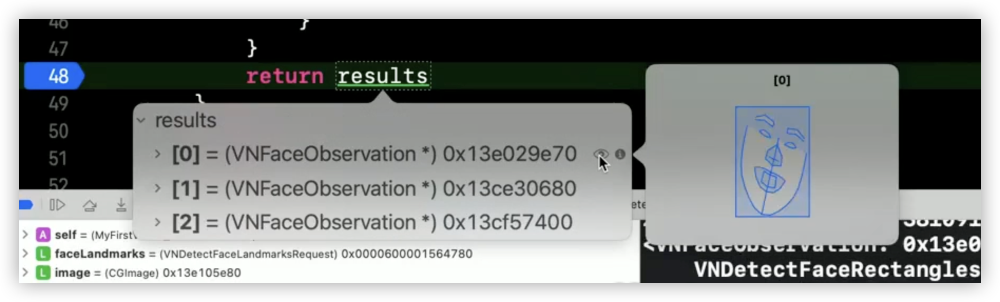

- NEW: Person segmentation (人物分割)
  collapsed:: true
	- {:height 360, :width 491}
- NEW: hand pose estimation (手勢估計)
  collapsed:: true
	- 
- Text recognize
  collapsed:: true
	- best : specify languages to vision, leave automatically DetectsLanguage turned off
	- spoort 韓文
- New ML-based **barcode** detector and decoder
	- Faster for multiple codes — "constant time"
	- VNDetectBarcodesRequestRevision3
	- VNDetectBarcodesRequestRevision2 vs VNDetectBarcodesRequestRevision3
		- VNDetectBarcodesRequestRevision2
			- {:height 326, :width 215}
			- 1. missing first barcode
			  2. detected the second barcode twice
			  3. a line through the barcode rather than complete bounding box.
		- VNDetectBarcodesRequestRevision3
			- {:height 394, :width 412}
			-
- New ML-based optical flow generator
  collapsed:: true
	- {:height 265, :width 499}
	- video object track use
- Face Landmarks
	- VNDetectFaceLandmarksRequestRevision3
	- Xcode support quick look to see face landmark
		- {:height 310, :width 610}
		- if image is already release in memory, debug tool can still generate below image
			- {:height 233, :width 616}
- quick look