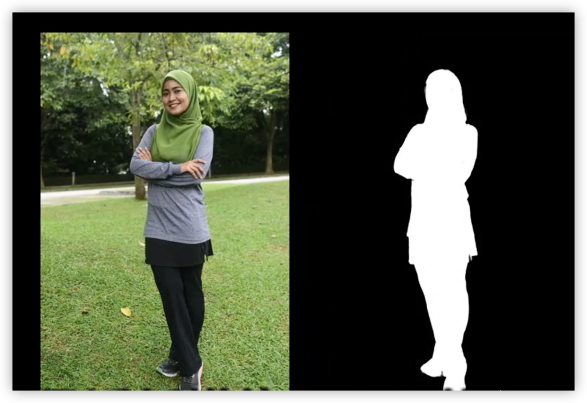
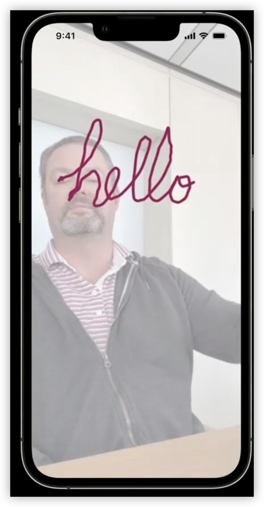
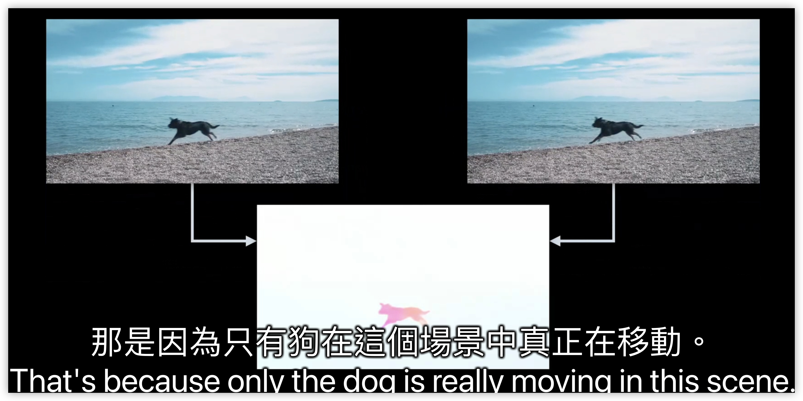

- NEW: Person segmentation (人物分割)
  collapsed:: true
	- {:height 360, :width 491}
- NEW: hand pose estimation (手勢估計)
  collapsed:: true
	- 
- Text recognize
	- best : specify languages to vision, leave automatically DetectsLanguage turned off
	- spoort 韓文
- New ML-based **barcode** detector and decoder
	- Faster for multiple codes — "constant time"
- New ML-based optical flow generator
	- {:height 265, :width 499}
	- video obje use