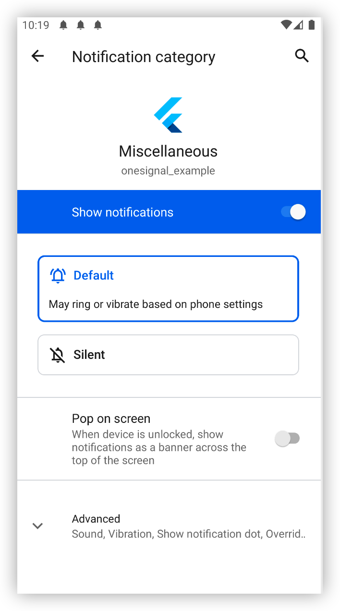

- ## Reason
- 1. [example](https://github.com/OneSignal/OneSignal-Flutter-SDK/tree/main/example) does not create custom channel, if no existing channel, OneSignal push notification will use `Miscellaneous` channel as default channel, but this channel does not have enable `Pop on screen`  permission, so the notification cannot show in screen
- {:height 345, :width 191}
- ## Solution (not confirmed)
- 1. create