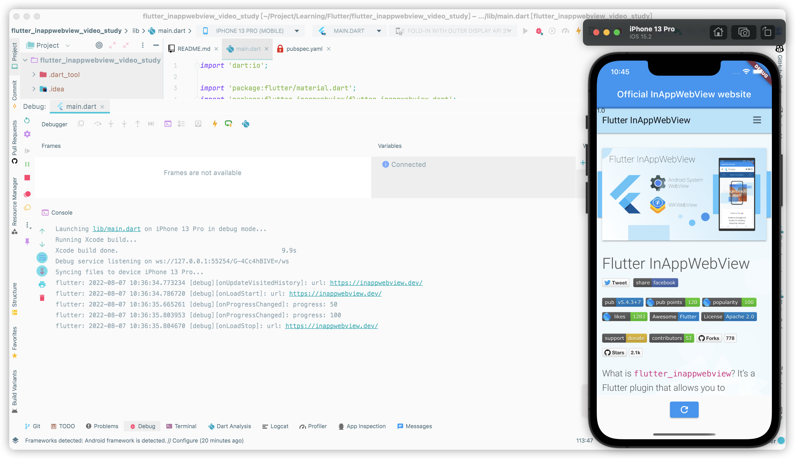
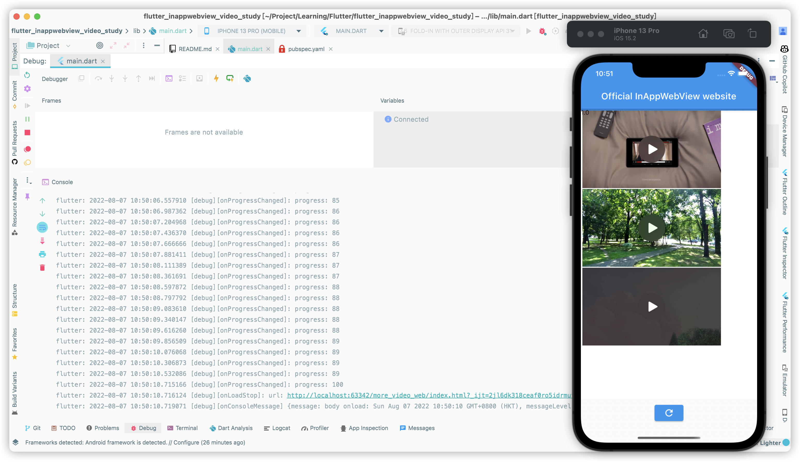
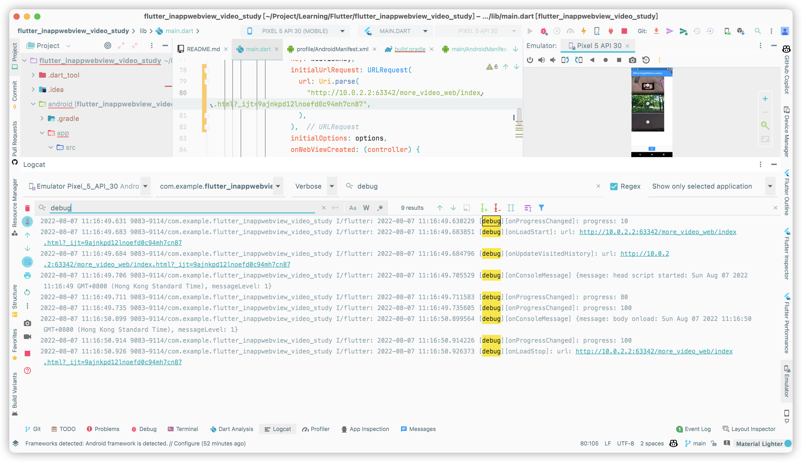

- package: [flutter_inappwebview](https://pub.dev/packages/flutter_inappwebview)
- ## Normal case example
- ### code:
- {{renderer :linkpreview,https://github.com/WingCH/Learning/blob/5faee74255eb24a18b2bddcbb7aebe74f613a985/Flutter/flutter_inappwebview_video_study/lib/main.dart}}
- ### Result:
- Step:
- 1. onUpdateVisitedHistory
  2. onLoadStart
  3. onProgressChanged until 100%
  4. onLoadStop
- 
- ---
- ## Video example
- ## iOS
- ### Step: (preview enabled)
- #### dart side: (10:49:56.278666 to 10:50:10.716124) = ~14s
	- 1. onLoadStart (10:49:56.278666)
	  2. onProgressChanged until 100% (10:49:56.294044 to 10:50:10.715166)
	  3. onLoadStop (10:50:10.716124)
- #### web side:
	- 1. start (10:49:56.454968)
	  2. body onload event trigger (10:50:10.719071)
- 
- #### Tried 5 times (preview enabled)
- 1. 11:28:12.723413 to 11:28:16.683238 = ~4s
  2. 11:29:30.897574 to 11:29:34.691882 = ~4s
  3. 11:30:29.345046 to 11:30:29.591031 = ~0.5s
  4. 11:31:23.764104 to 11:31:27.060416 = ~4s
  5. 11:32:12.898111 to 11:32:16.15298 = ~4s
-
- #### Tried 5 times (preview disabled)
- 1. 11:34:05.413464 to 11:34:05.563590
  2. 11:36:06.613571 to 11:36:06.810674
  3. 11:37:57.900841 to 11:37:58.058672 
  4.
- ## Android
### Step:
- #### dart side: (11:16:49.683851 to 11:16:50.926373)
	- 1. onLoadStart (11:16:49.683851)
	  2. onProgressChanged until 100% (11:16:49.630229 to 11:16:50.914226)
	  3. onLoadStop (11:16:50.926373)
- #### web side:
	- 1. start (11:16:49.705529)
	  2. body onload event trigger (11:16:50.926373)
- 