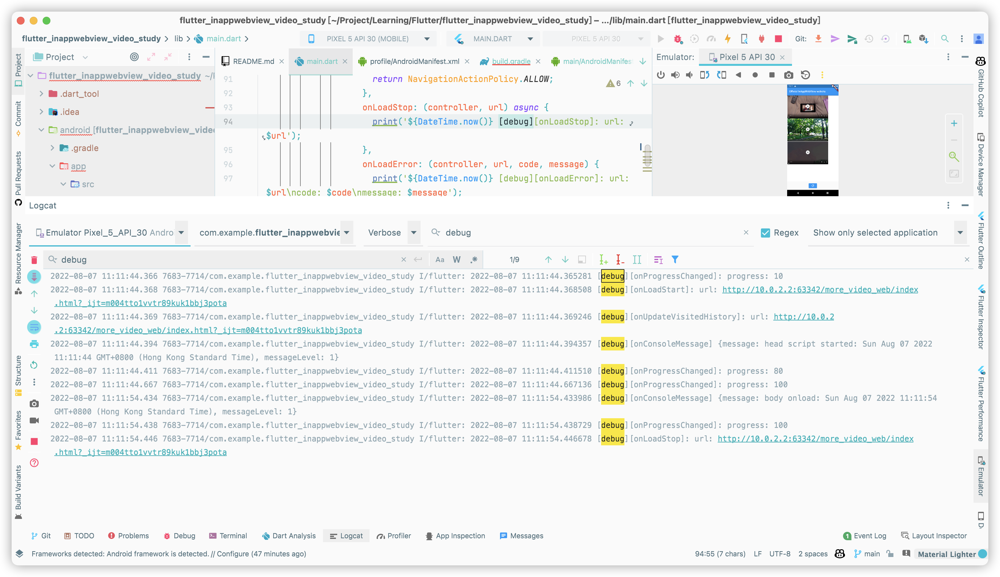

- package: [flutter_inappwebview](https://pub.dev/packages/flutter_inappwebview)
- ## Normal case example
- ### code:
- {{renderer :linkpreview,https://github.com/WingCH/Learning/blob/5faee74255eb24a18b2bddcbb7aebe74f613a985/Flutter/flutter_inappwebview_video_study/lib/main.dart}}
- ### Result:
- Step:
- 1. onUpdateVisitedHistory
  2. onLoadStart
  3. onProgressChanged until 100%
  4. onLoadStop
- 
- ---
- ## Video example
- ## iOS
- ### Step:
- #### dart side: (10:49:56.278666 to 10:50:10.716124)
	- 1. onLoadStart (10:49:56.278666)
	  2. onProgressChanged until 100% (10:49:56.294044 to 10:50:10.715166)
	  3. onLoadStop (10:50:10.716124)
- #### web side:
	- 1. start (10:49:56.454968)
	  2. body onload event trigger (10:50:10.719071)
- 
- ## Android
### Step:
#### dart side: (10:49:56.278666 to 10:50:10.716124)
-
-
- 